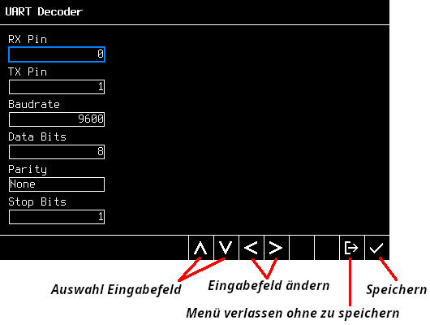

# ITS-Board Logic Analyzer

Dies ist eine Dokumentation zum ITS-Board Logic Analyzer.

## Was ist ein Logic Analyzer?

> Ein Logikanalysator (engl.: Logic Analyzer) ist ein elektronisches Messgerät,
> das den Zeitverlauf von digitalen Signalen aufzeichnet und anzeigt. Er dient
> dazu, die Funktionsweise digitaler Schaltungen zu untersuchen und Fehler zu
> finden, indem er die Signale zwischen verschiedenen Komponenten visualisiert
> und analysiert.

## Motivation

Im Rust WP Praktikum ist das Projekt entstanden, einen standalone Logic Analyzer auf dem ITS-Board zu realisieren. Das kann bei der Bearbeitung der
4. Praktikumsaufgabe in GS hilfreich sein, um sich die Signale zwischen dem
ITS-Board und den über das One-Wire Protokoll angesteuerten Temperatursensoren
(`DS28B12`) zu visualisieren.

## Installation des Logic Analyzers auf dem ITS-Board

Den Logic Analyzer kann man mithilfe der Anwendung ITS-Board-Uploader
auf dem ITS-Board installieren, welche in diesem Ordner mitgeliefert
ist.

Hierzu startet man das Programm `uploader/bin/uploader.exe`.
Wählt dann im Menü den LogicAnalyzer aus und drückt auf Upload,
während das ITS-Board mit dem Computer verbunden ist.

Wenn der Logic Analyzer nicht nach dem Upload startet, sollte man nach
etwa 10 Sekunden den Reset-Taster am ITS-Board drücken.

## Bedienung

Die Bedienung des Logic Analyzers erfolgt über die Taster am
ITS-Board.

Das folgende Bild beschreibt die Funktionalitäten auf dem Hauptbildschirm.

Die Leiste am unteren Rand des Bildschirms zeigt die aktuelle
Funktion für jede der acht Tasten an.

Die Start-Taste beginnt eine neue Aufnahme (Capture).
Die Aufnahme endet, wenn man die Stop Taste drückt, oder der interne Puffer
voll ist, oder die maximale Aufnahmezeit von 45 Sekunden erreicht wurde.
Die aufgenommenen Daten werden dann auf dem Bildschirm dargestellt.

### Technische Details

Der Aufnahmepuffer speichert nur Pin-Änderungen (Rising und Falling Edge), d.h.
wenn viele Pinänderungen auftreten, wird der Buffer schneller voll. Zu jeder
Änderung wird der Zustand vom Port D (1 Byte) sowie der Timestamp (Timer Tick)
seit Capture-Start (4 Bytes) gespeichert.

## Protokoll Decoder

Protokoll Decoder wandeln die digitalen Signale in ein leichter
zu lesendes Format um, also statt die Wellenform mühsam per Hand zu
dekodieren, versteht der Logic Analyzer das Protokoll z.B. I2C oder
One-Wire und kann so die empfangenen Daten interpretieren.

Im `Select Protocol Decoder` Menü kann man den gewünschten Protokoll Decoder
auswählen.

Dann muss man die Einstellungen zum Protokoll Decoder festlegen, hauptsächlich
die Pinzuordnung, aber auch z.B. die Baudrate bei einer seriellen Schnittstelle.

Beim drücken auf die Entertaste werden die Einstellungen übernommen und man
kehrt zum Hauptbildschirm zurück.

Die Konfiguration des Protokoll-Decoders wird im internen Flash gespeichert.
Dadurch bleiben die Einstellungen erhalten, auch wenn man das ITS-Board
ausschaltet.

## Cursors

Mit den Cursorn kann die Zeit zwischen zwei Ereignissen gemessen werden.

## Anwendung für die 4. GS Praktikumsaufgabe

Hierzu braucht man zwei ITS-Boards. Eins, auf dem der
Logic Analyzer läuft, und eins, auf dem euer Code für
die Praktikumsaufgabe läuft.

Der Ground beider Boards muss verbunden sein, sowie den
Pin 0 auf Port D beider Boards, da das der Pin ist, über
den die Temperatursensoren angesprochen werden.

Dann kann man einen Protokolldecoder für OneWire auf
Pin 0 im Menü hinzufügen.

## Bugs

Die Software ist in aktiver Entwicklung. Wenn Fehler oder allgemein
unerwartetes Verhalfen auftritt, würden wir uns über einen Bug-Report
freuen. Fragen zur Bedienung sowie Anregungen für zukünftige Features
sind natürlich auch gerne willkommen.

Konkakt: Auf MS Teams Anton Tchekov
